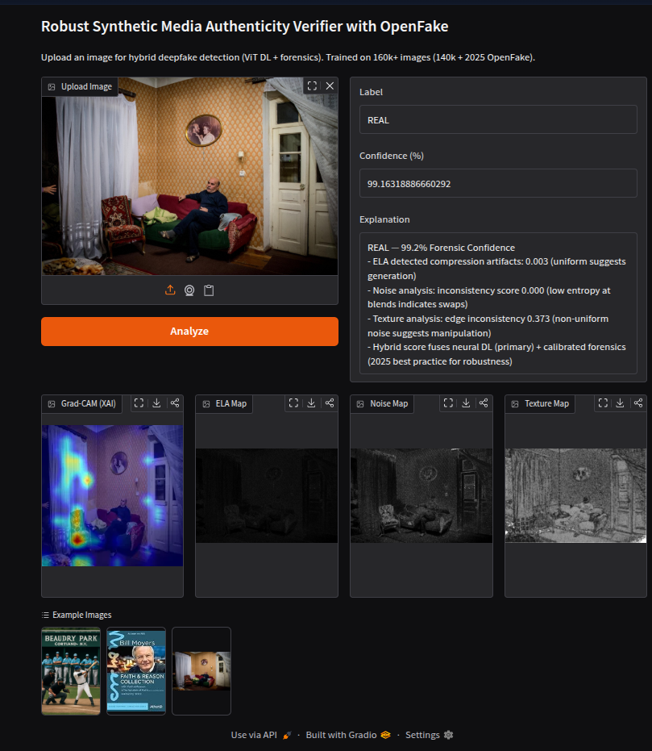

# DeepFake Verifier: ViT Deepfake Forensics with Grad-CAM, ELA & Noise Analysis

A hybrid deepfake detection system combining a fine-tuned Vision Transformer (ViT) with classical forensic signals: Error Level Analysis, noise inconsistency mapping, and LBP texture analysis. This allows for a robust real/fake image classification with full explainability factor.

The demo is here (**warning: free tier of hugging space WILL take time to load and execute**)
[Demo](https://huggingface.co/spaces/kairavaclfe/vit-deepfake-forensic)

There's some examples images to try out in the bottom



---

## How It Works

This detector doesn't rely on a single signal. It fuses:

- **ViT (94% weight)** : `google/vit-base-patch16-224-in21k` fine-tuned on ~160k real/fake images from two datasets
- **Error Level Analysis (ELA)** : detects JPEG compression artifacts inconsistent with genuine camera images
- **Noise Inconsistency Map** : Laplacian-based local variance analysis to surface blending seams and GAN noise patterns
- **LBP Texture Analysis** : Local Binary Pattern entropy mapping to detect non-uniform texture manipulation

The final confidence score is a calibrated weighted blend of all four signals, following 2025 best practices for multi-signal forensic robustness.

> **Key design decision:** Classical forensic signals are deliberately weighted at only 6% combined. This is intentional : see [Findings](#findings--motivation) below.

---

## Explainability

Every prediction comes with four visual overlays:

| Output | What it shows |
|---|---|
| **Grad-CAM** | Which regions of the image the ViT focused on |
| **ELA Map** | Compression artifact hotspots |
| **Noise Map** | Local noise variance anomalies |
| **Texture Map** | Edge and texture inconsistency |

---

## Training Data

| Dataset | Images | Source |
|---|---|---|
| JamieWithofs/Deepfake-and-real-images | ~140k | Hugging Face |
| sanketghadge1/openfake-data-20k-img | ~20k | Kaggle |
| **Combined** | **~160k** | Train + eval |

Labels: `0 = REAL`, `1 = FAKE`

---

## Model

- **Base:** `google/vit-base-patch16-224-in21k`
- **Fine-tuned for:** Binary classification (REAL / FAKE)
- **Training:** 3 epochs, batch size 96, fp16, best checkpoint by accuracy

---

## Setup

```bash
pip install transformers grad-cam datasets accelerate opencv-python-headless pillow matplotlib scikit-image kagglehub
```

---

## Usage

```python
result = verify_image("path/to/image.jpg")

print(result["explanation"])       # Full forensic breakdown
result["cam_image"]                # Grad-CAM overlay (numpy RGB)
result["ela_image"]                # ELA heatmap
result["noise_image"]              # Noise inconsistency map
result["texture_image"]            # Texture inconsistency map
```

### Output format

```python
{
    "label": "FAKE",               # or "REAL"
    "confidence": 0.94,            # hybrid score (0–1)
    "cam_image": np.ndarray,       # Grad-CAM overlay
    "ela_image": np.ndarray,       # ELA map
    "noise_image": np.ndarray,     # Noise map
    "texture_image": np.ndarray,   # Texture map
    "explanation": str             # Human-readable forensic summary
}
```

---

## Forensic Score Weights

```
Final Score = 0.94 × ViT prob
            + 0.02 × ELA score
            + 0.02 × Noise score
            + 0.02 × Texture score
```

The ViT is the primary signal. Classical forensic channels are deliberately downweighted because ELA, noise, and texture analysis are largely ineffective against modern diffusion-based generators (Grok, Midjourney, DALL-E) : they remain in the pipeline as calibration layers for older GAN artifacts and photo splicing, not as primary detectors. See [Findings](#findings--motivation) for the full rationale.

---

## Architecture

```
Input Image
    │
    ├──► ViT (fine-tuned) ──────────────────► fake_prob (×0.94)
    │
    ├──► JPEG re-compression ──► ELA map ──► ela_norm  (×0.02)
    │
    ├──► Laplacian variance ──► Noise map ──► noise_norm (×0.02)
    │
    └──► LBP entropy ────────► Texture map ► texture_norm (×0.02)
                                                │
                                         Hybrid Score
                                         → REAL / FAKE + confidence
```

---

## Findings & Motivation

### Classical forensics are failing on modern generators

ELA, noise analysis, and texture inconsistency were useful for detecting older face-swaps and photo manipulation : but they break down on images from modern diffusion models (Grok, Midjourney, DALL-E) for a simple reason: each signal looks for artifacts that synthetic generation never produces in the first place. ELA needs a real photo's compression baseline to compare against. Noise analysis needs splice boundaries. Texture analysis needs locally inconsistent regions. Diffusion models produce none of these.

This is why classical signals are weighted at only **2% each (6% total)** : they still catch older GAN artifacts and photo splicing, but they are calibration layers, not primary detectors.

### Transformers generalize better than CNNs

ViT-based architectures show roughly 11% performance decline when tested on unseen generators, versus over 15% for CNN-based models. For a detector that needs to handle images from generators it was never explicitly trained on, this matters.

### The arms race

Deepfake generators are trained adversarially : any pixel-level signal that becomes a known detection target can be trained away. This is why the primary signal must be a high-capacity neural model trained at scale, not hand-crafted forensic heuristics.

### What comes next

The longer-term industry direction is cryptographic media provenance (C2PA) : a tamper-evident chain of custody embedded at capture. However, as of 2025 most major platforms strip C2PA metadata on upload, breaking the chain. Until provenance infrastructure matures, fine-tuned neural models remain the most practical line of defense.

---

## License

MIT